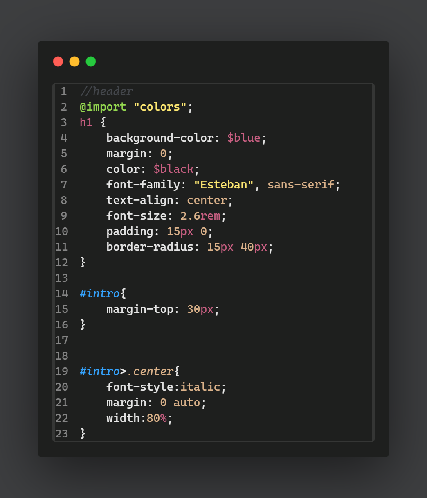

# Charcoal calm

**Charcoal Calm** is a visually striking dark theme for Visual Studio Code that combines a deep charcoal background with vibrant, eye-catching accents. Perfect for developers who appreciate a bit of color to enhance code readability and bring a touch of energy to their coding environment. Made by RediThemes.

## Features

- **Vibrant Accents:** Eye-catching colors like pink, yellow, and green, blue in light shades for syntax highlighting, making different code elements stand out.
- **Deep Charcoal Background:** A smooth, dark gray background that reduces glare and keeps your focus sharp.
- **Enhanced Readability:** Carefully selected color schemes ensure clarity and reduce eye strain, while vibrant accents help differentiate between code elements.
- **Consistent Visuals:** A cohesive and aesthetically pleasing palette that provides a lively yet distraction-free coding space.

## Installation

1. Open Visual Studio Code.
2. Go to the Extensions view by clicking on the Extensions icon in the Activity Bar on the side of the window or pressing `Ctrl+Shift+X`.
3. Search for `Charcoal Calm`.
4. Click `Install`.

## Usage

To activate the **Charcoal Calm** theme:

1. Open the Command Palette by pressing `Ctrl+Shift+P`.
2. Type `Color Theme` and select `Preferences: Color Theme`.
3. Choose `Charcoal Calm` from the list.

## Explore More Themes

If you’re interested in exploring more themes, check out the [Visual Studio Code Marketplace](https://marketplace.visualstudio.com/vscode) for a wide selection of themes to suit any preference.

## Feedback

If you encounter any issues or have suggestions for improvement, please open an issue on the [GitHub repository](https://github.com/RediThemes/charcoal-calm).

## License

This theme is licensed under the [MIT License](LICENSE).

---

Enjoy a vibrant and productive coding experience with **Charcoal Calm**!

